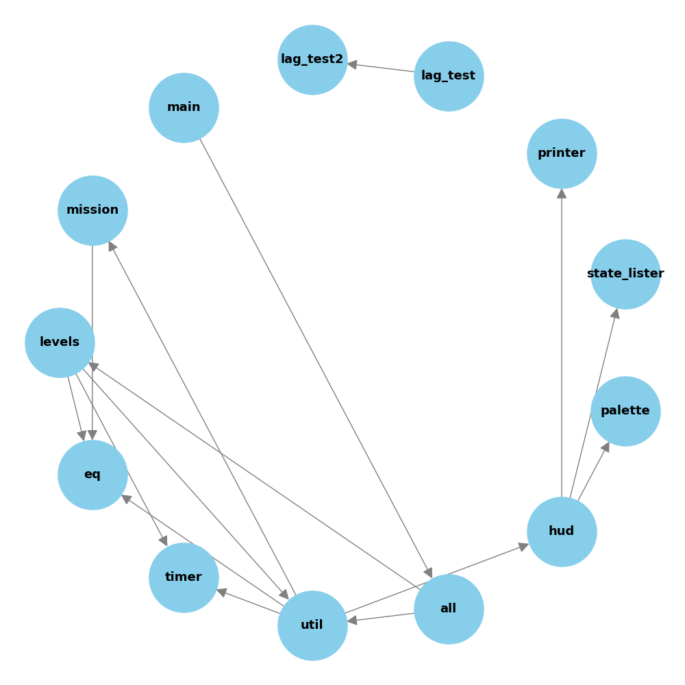

# Stonescripts for Stone Story RPG

## What is this?

The ASCII-art game [Stone Story RPG](https://store.steampowered.com/app/603390/Stone_Story_RPG/) allows you to write scripts to automate the player's behavior once you get the Mind stone.

The scripts functions well for game version v3.61.4 as of 2024-06-05.


## Usage

1. Clone this repository as a subfolder of the Stonescript directory called `UserScript`.
   The cloning command should look like: (remember to modify <Steam ID>)
   
   ```bash
   cd %AppData%\LocalLow\Martian Rex, Inc_\Stone Story\<Steam ID>\Stonescript
   git clone https://github.com/asHOH/StoneScript.git UserScript
   ```

   For powershell,

   ```powershell
   cd $env:USERPROFILE\AppData\LocalLow\Martian Rex, Inc_\Stone Story\<Steam ID>\Stonescript
   git clone https://github.com/asHOH/StoneScript.git UserScript
   ```

2. Copy-paste the content of the [main.txt](https://github.com/asHOH/StoneScript-for-Stone-Story-RPG/blob/master/main.txt) ("import UserScript/all", simple as it is) into the in-game Mindstone UI.

3. Modify the scripts for your own playing. Enjoy!


## Useful information for the game

1. Use the Power button at the top-right of the in-game Mind Stone UI to toggle the script ON/OFF. You may press M to open the mindstone while playing a level.

2. Hold TAB for debug information while playing a level.

3. In txt files, it's safe to exceed 48 characters per line, unlike the in-game Mind Stone UI.

4. Refer to [Stone Story RPG Wiki](https://stone-story-rpg.fandom.com/wiki/Stone_Story_RPG_Wiki), [this document](https://docs.google.com/document/d/1ydn2PqK_AGXhX168IryDyiJ2Hp49zXuM6dw-0fLzzR0/edit)  and [discord](https://discord.com/channels/423242655498240000/423242655498240005) for help.

5. For stonescript, I would recommend Microsoft VSCode with Stonescript extension for (somewhat) smooth development. Check the official guide if you encounter issues:
   - [Official intro to Stonescript](https://stonestoryrpg.com/stonescript/)
   - [Official full manual of Stonescript](https://stonestoryrpg.com/stonescript/manual.html)
   - [more about Stonescript.md](https://github.com/asHOH/StoneScript-for-Stone-Story-RPG/blob/master/more%20about%20Stonescript.md) in this project.

6. Stone Story is awesome, but life is also awesome! Remember to spend time with your friends and family members, and enjoy the outdoors!


## About this project

A dependency plot is shown here. Unshown scripts are [**s.txt**](https://github.com/asHOH/StoneScript-for-Stone-Story-RPG/blob/master/s.txt), which stores system variables and functions and is imported into almost every module, and **00_rocky_plateau to 07_temple**, which are abbreviated to "levels" in the graph.


## Acknowledgments

Thanks to [JCBoorgo](https://pastebin.com/u/JCBoorgo), MaxMinMedian (Discord: MaxMinMedian) and [Incoherent_toast](https://github.com/Incoherent-Toast) for kindly granting me the use of their code in this project!

I would also like to thank [Matjaž](https://github.com/TheMatjaz) for the inspiration and guidance provided by [his StoneScript project](https://github.com/TheMatjaz/StoneScript).